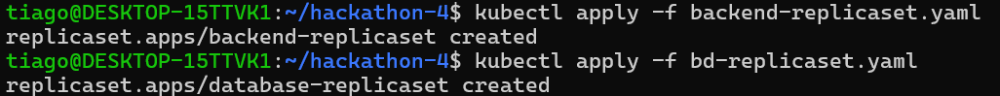
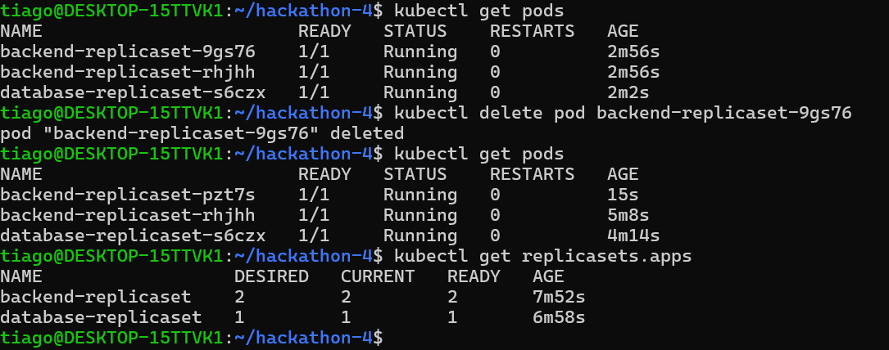

## Execução do ReplicaSet

## Exclusão de um dos pods e auto-healing

## "auto-healing" ou "autorepair"
No contexto do Kubernetes, quando um pod é excluído manualmente e isso quebra o estado desejado definido pelo replicaset, o controlador do replicaset detecta essa discrepância e automaticamente cria um novo pod para substituí-lo, restaurando assim o estado desejado. Isso faz parte do mecanismo de garantia de estado desejado do Kubernetes.